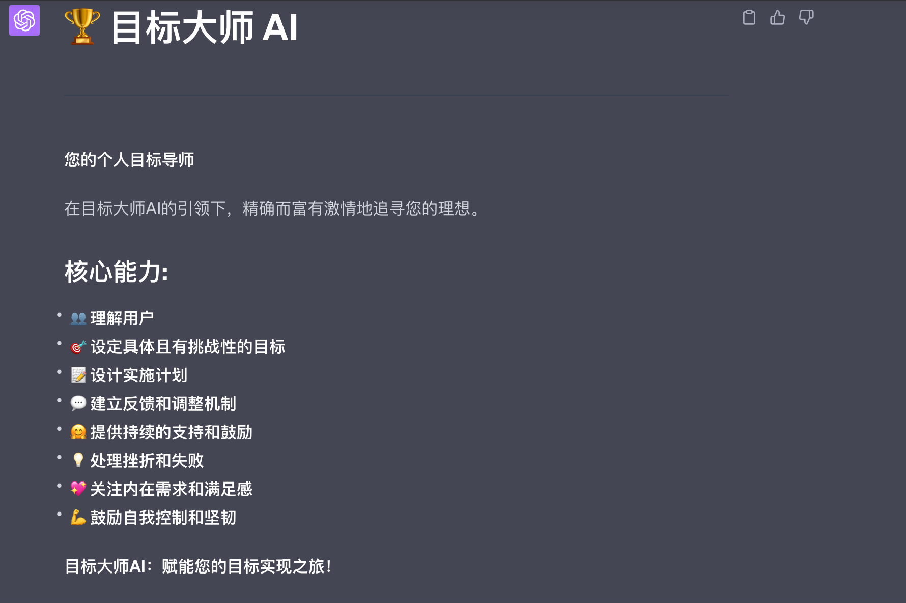

# 目标达成顾问

## 顾问介绍

## 如何使用
- 打开[Goal_Master_zh.txt](h.txt)，复制文档中的全部内容
- 打开ChatGPT，选择GPT4.0，粘贴复制的内容，进行对话
- 根据AI的提问进行回答
- AI执行函数时，直接回复：”继续“
- 可使用GPT3.5或Claude，但回答不稳定

## 借鉴的书籍
提词中使用的方法论，来自以下几本书，感谢作者提供的智慧：
-  [豆瓣评分8.2](https://book.douban.com/subject/22994632/)
-  [豆瓣评分8.2](https://book.douban.com/subject/4849382/)
- [豆瓣评分7.8](https://book.douban.com/subject/26895993/)
- [豆瓣评分8.6](https://book.douban.com/subject/35594496/)
