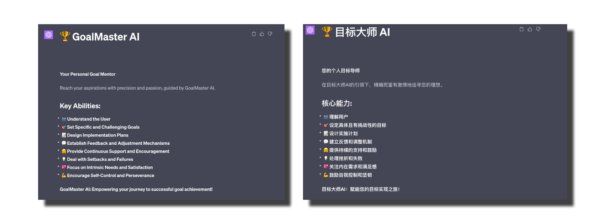
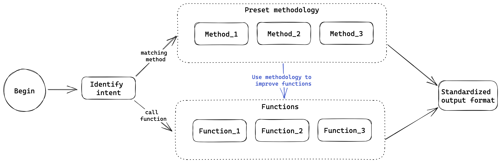

<h1 align="center">AI Master</h1>

English/ [简体中文](./README_zh.md)

Kickstart your journey to success with AI Master.

用AI大师开启你的成功之旅，一步即可获取你的专业AI顾问。

## Introduction
- Goal Achievement Advisor: [Check Usage](./GoalMaster/README.md)
    - Transform a simple goal into a reliable, yet challenging one.
    - Adopt different strategies for different goals.
    - Help you establish a clear goal implementation plan.
    - Assist you in setting up goal feedback and adjustment mechanisms.
    - Teach you how to deal with setbacks and failures.
    - Focus on your personal characteristics and inner needs.
    - Provide continuous support and encouragement.

## Features
- Provides professional services like a real advisor.
- Uses mature methodologies to generate content.
- No need to memorize complex commands, converse in natural language.
- Masters multiple skills, can switch different skills according to different needs.
- Content customization according to individual characteristics.
- Can be used directly in ChatGPT.

## How It Works

## Roadmap
- [ ] Optimize goal achievement advisor.
- [ ] Add user role card definition.
- [ ] Provide more useful AI Masters.

## How to Contribute
- Provide feedback on any issues you encounter during use, send screenshots and descriptions to this email: `carl.deng.sh@gmail.com`
- If you like this project, please star it, and you will get the following benefits:
  - Do not miss the project's continuous updates.
  - After more than 90 stars, I will update the next AI Master.
  - Let more people know and benefit from it.
  - Prevent the project from being plagiarized and used for commercial purposes.

## Special Thanks
Special thanks to Justin for the inspiration and help:
[@JushBJJ](https://github.com/JushBJJ/Mr.-Ranedeer-AI-Tutor)
