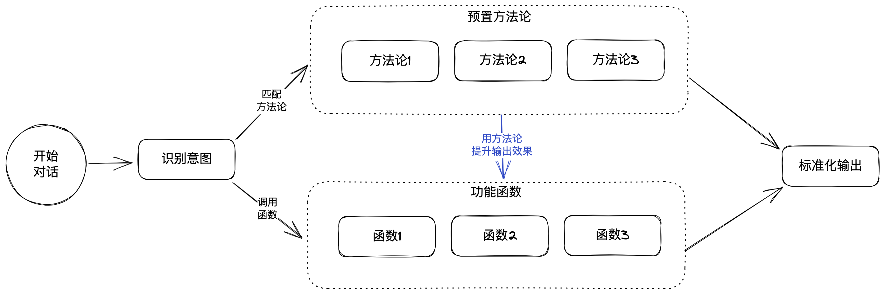

<h1 align="center">AI Master</h1>

[English](./README.md) / 简体中文

Kickstart your journey to success with AI Master.

用AI大师开启你的成功之旅，一步即可获取你的专业AI顾问。

## 顾问介绍
- 目标达成顾问：[查看使用方式](./GoalMaster/README_zh.md)
    - 把一句话目标，变为靠谱，又有一定挑战的目标
    - 面对不同的目标，采用不同达成策略
    - 帮助你制定明确的目标实施计划
    - 帮助你建立目标反馈和调整机制
    - 教你如何应对挫折和失败
    - 关注你的个人特性和内在的需求
    - 提供持续的支持和鼓励

## 项目特色
- 像真正的顾问一样提供专业的服务
- 使用成熟的方法论来生成内容
- 无需记忆复杂指令，可像自然语言一样对话
- 同时掌握多种技能，可根据不同的需求，切换不同的技能
- 根据个人特性定制化内容
- 可直接在chatGPT中使用

## 实现原理

## 下一步计划
- [ ] 优化目标达成顾问
- [ ] 增加用户角色卡定义
- [ ] 提供更多实用的AI顾问

## 如何贡献
- 反馈你在使用过程中遇到的问题，用截图的和文字的方式发送到这个邮箱：`carl.deng.sh@gmail.com`
- 如果你喜欢这个项目，请给项目一个星，你将获得如下好处：
  - 不错过项目的持续更新
  - 超过90个星后，我会更新下一个AI顾问
  - 让更多的人知道，让更多的人受益
  - 避免项目被盗用，并用作商业用途

## 特别感谢
特别感谢Justin给予的灵感和帮助：
[@JushBJJ](https://github.com/JushBJJ/Mr.-Ranedeer-AI-Tutor)